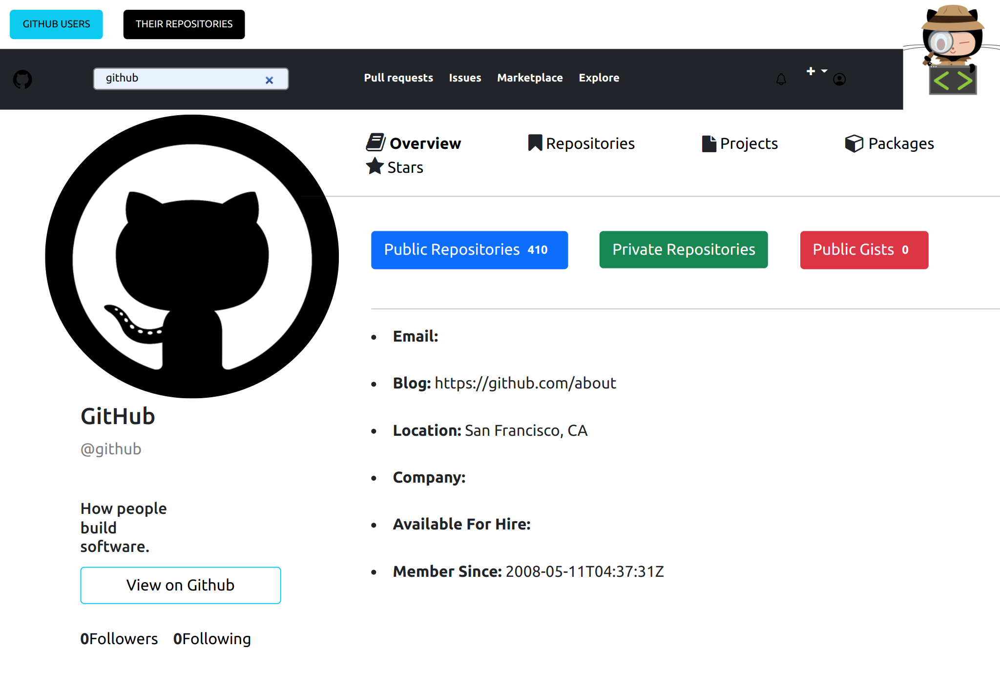

# Github_Search

#### By Wendy Nina

This project was generated with [Angular CLI](https://github.com/angular/angular-cli) version 13.3.0.
## Table of Content

+ [Description](#description)
+ [Installation Requirement](#Installation)
+ [Technology Used](#technology-used)
+ [Reference](#reference)
+ [License](#license)
+ [Authors Info](#author-Info)

## Description
Github_Search is is a simple application that lets you search for github users, be able to view  their profile information as well as their repositories.

### Requirements
-Either a computer,phone,tablet or an Ipad

-Make sure you have access to internet

-Click on the live link in the about section

-Make sure to fill in all details in the form to post your quote.

[Go Back to the top](#Github_Search)

### Installation Process
Clone the github repository using either https or ssh or alternatively download the zipped file.

Inside the application folder Run `ng serve` for a dev server. Navigate to `http://localhost:4200/`. The application will automatically reload if you change any of the files.
## Technology Used
TypeScript- To add functionality.

HTML-which was used for the templates.

CSS- used to style the templates.

Bootstrap- which was used to build and style the form.

## Reference
(https://getbootstrap.com/docs/3.3/components/)

[Go Back to the top](#Github_Search)

# License
Copyright (c) 2022 [click to view License](LICENSE)

## Authors Info
Linked In-[Wendy Nina]
(https://www.linkedin.com/in/wendy-nina-616559196/)

CodeWars-(https://www.codewars.com/users/the@rt_Coder)

[Go Back to the top](#Github_Search)

